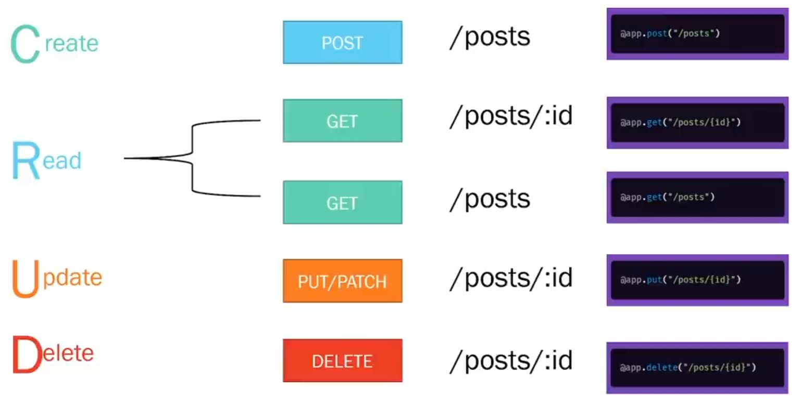

## Python's Script VS Module VS Package VS Library

- A script is a Python file that’s intended to be run directly.
- A module is a Python file that’s intended to be imported into scripts or other modules. It often defines members like classes, functions, and variables intended to be used in other files that import it.
- A package is a collection of related modules that work together to provide certain functionality.
  - These modules are contained within a folder and can be imported just like any other modules.
- A library is an umbrella term that loosely means _a bundle of code_.

  - These can have tens or even hundreds of individual modules/packages that can provide a wide range of functionality.

- To tell python that a certain folder is a package we have to put an **init.py** in it.
- Consider package as a folder that contain 1 or more modules.

## Creating a Simple API using FastAPI:

- Import FastAPI.
- Create a FastAPI instance to make the backend app.
- Write a path operation/route decorator (like @app.get("/")).
- Write a path operation/route function (like def root():).
- Run the development server so that the backend app start listenting to a specific port (like uvicorn main:app --reload).

- FastAPI has built in support for docs which can be found with the /docs or /redoc url.

## Path Operation aka Routes

- A route/path operation has 3 main component:

  - Method: HTTP method
  - Path: The path url
  - Function: The function to be called when the specific path is called with the specific http method

- The function can now have some parameters with them this can either be the payload that comes with the request or it can be from the url.

  - The url can have variables in them basically paramitarised urls.
  - The request can have a payload attached with it like in POST request.
  - We have to manage these using and do the specific task in the function so the function should know these variables and hence sometimes the function takes in these variables.

- To validate the type of data send with the request we use the Schema.

## API and Backend

- The backend app is just an app running on a server that listens to a specific port and whenever it gets some request, it work on that request and return the required response back.
- The backend can work in 2 major ways it can either work on the request do something with the database and send back the data or it can also send back the HTML file.

- API is just an app in the server that provides you with it's functionality.
- The server interaction is all about request and response, the server listen for a request and when it get's a request it will give back a response according to it.

- `GET` is a http method other main methods are `POST`, `PUT`, `DELETE`.

- Using parameters in `GET` request but remember the parameters will be string if you want int then convert it inside the function

- When we create multiple routes the first match is the only one get executed so ORDER does matter.

- Postman is a good tool for giving requests.

- A `schema` is metadata that tells us how our data is structured. Schema is used for validation of data in a http method where the API is provided with a some data like POST request or send some data using GET request.
- We do this using **pydantic** module in python.

- CRUD application is Create, Read, Update, Delete

  - Create -> POST (because data is also send to server in POST request)
  - Read -> GET
  - Update -> PUT/PATCH
  - Delete -> DELETE
    

- **Payload** is the part of transmitted data that is the actual intended message. The payload can be sent or received in various formats, including JSON.

- **Status Codes** are the codes that tell us what is the status of our request to the server.

- We should also consider cases when our API will throw an exception and implement them reasonably by sending required data and status code explaining exception.

- It is a good practice to create API using REST(Representational State Transfer) architecture.

## Database

- We use databases for storing data instead of memory of program.
- We don't interact with databases directly instead we use a DBMS.

- DBMS are of 2 main category

  - Relational (SQL based) eg. MYSQL, POSTGRESQL
  - NoSQL eg. MongoDB, DynamoDB

## Relational Database

- In a realational database we have the concept of tables, where each table contains the record or the data we wanna save, now each table will have the rows which are basically data entry and columns that will tell what kind of data each entry have.

  - Table represent the subject or event in an application.
    - eg Users, Posts etc.
  - Each Column represent different attribute.
  - Each Row represent different entries in the table.
  - Database have different datatype for the attributes.

- **Primary key** is a column or group of columns that uniquely identifies each row in a table.

  - Table can have one and only one primary key.

- _UNIQUE_ Constraint can be applied to any column to make sure every record have a unique value for that column.
- _NOT NULL_ Constraint can be applied to any column to make sure that the column is never left blank.

  - When a column is left blank it has a null value.

- SQL(Structured Query language) is the language used to communicate with the DBMS in Relational database.

- We use a `DB driver` to interact with DB from our program, using SQL.

- ORM(Object Relational Mapper) is a layer of abstraction that sits on top of DB. We perform all DB operation with python code and ORM is gonna convert them to SQL and interact with the DB for us.
- We can define a table as Python Object model and queries are made using python only.
- We will still need DB driver for interaction.

- An ORM maps between an Object Model in code and a Relational Database. An ODM maps between an Object Model in code and a Document Database. PostgreSQL is not an ORM, it's a Relational Database, more specifically, a SQL Database. MongoDB is not an ODM, it's a Document Database.
- An ORM use a SQL database Driver to translate the object notation to relational notation and an ODM use a JSON or JSONB api to translate the Object notation to Document notation.

- Schema(Pydantic) model VS ORM Model
- Schema model defines structure of a request and response, how each parameter should look like, eg. message should be string, id should be int etc. Though they are completly optional they build strict typing kinda thing and help so that user doesn't give a bullshit request.

  - ORM model defines the column of our table, within our database.
  - It is used to do CRUD operation.

## Passwords in Database

- We store password by hasing them (we can't get the password back from the hashed form), so that even if the Database is infiltreted the theif can't do anything with the _hashed form of passwords_.

- A **cryptographic salt** is made up of random bits added to each password instance before its hashing. Salts create unique passwords even in the instance of two users choosing the same passwords. So even if 2 users have the same password their salt will be different which is added to the password and then they are hashed.

- Many a times our API will have many http requests so to handle them we put them in a seperate folder called router in which we create different files according to the table and use APIRouter to create them router's request, in the main the app (FastAPI instance) is going to include them using include_router.

## Authentication and Security

- Authentication can be done using JWT token, When the user's credentials are verified the API will assign a JWT(JSON Web Token) token to the user's system along with the response and will every request the Token will also be attached to it in it's header, the API will first check if the token is vaild or not, if it is then it will process the requests.

- Token is not encrypted so be careful what data you have in payload.

- A Token is made of 3 majors -> **Header**(Metadata -> Algo and TokenType), **Payload**(Data), **Verify Signature**(It takes the header, payload and the secret code that only we have access to, paas it to a hashing algo and give us a hashed signature)

- Token is not encrypted so be careful what data you have in payload, anyone can see and manipulate that data but again, the API will handle it. Now if someone change the payload, at the API side the API is gonna create the test signature from current payload, header and secret key the hash algo will give a different signature and the access will be denied.
