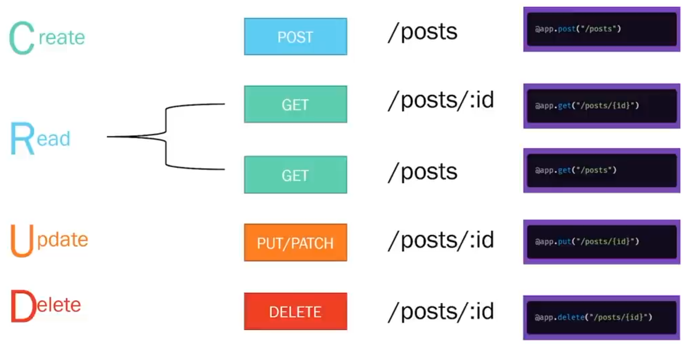
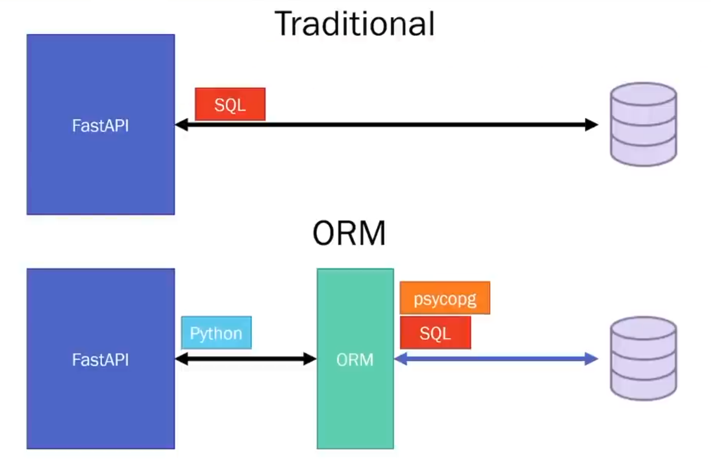
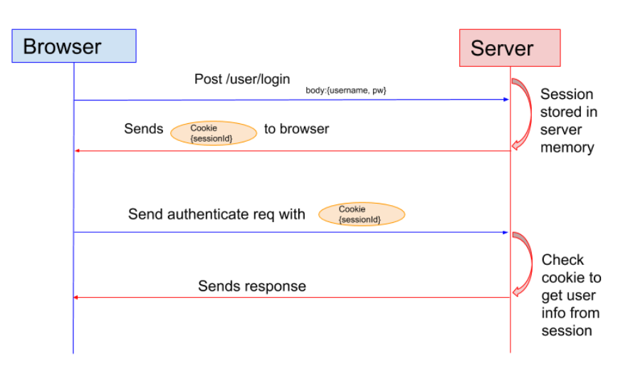

## Python's Script VS Module VS Package VS Library

- A script is a Python file that’s intended to be run directly.
- A module is a Python file that’s intended to be imported into scripts or other modules. It often defines members like classes, functions, and variables intended to be used in other files that import it.
- A package is a collection of related modules that work together to provide certain functionality.
  - These modules are contained within a folder and can be imported just like any other modules.
- A library is an umbrella term that loosely means _a bundle of code_.

  - These can have tens or even hundreds of individual modules/packages that can provide a wide range of functionality.

- To tell python that a certain folder is a package we have to put an **init.py** in it.
- Consider package as a folder that contain 1 or more modules.

## API (Application Programmer Interface)

- All Interfaces define ways for us to interact, or communicate with an object, whether that object be physical, or software, and as a user of the interface, we don't need to understand the implementation.

  - We don't need to know how it works. We just need to know what we've been allowed to change, or see.
  - Interfaces abstract away the implementation.
  - While the UI, or User Interface is made for the user of the application, API is made for the application programmer to use, and extend in their applications.

- An API is a contract of sorts, it defines how it's expected to be used, and it defines what you can expect to receive by using it.

  - They save you from needing to create everything yourself.
  - We use them to avoid recreating the wheel. That is to say they assist us in accomplishing tasks that we need to perform by abstracting away a ton of work for us. The stuff that we developers shouldn't be worrying about.

- These days, The term API is almost always used as a way to explain web-based APIs. In fact, it's probably safe to assume that when you hear API in the wild, it's most likely that people are talking about a web based API.

## Creating a Simple API using FastAPI:

- Import FastAPI.
- Create a FastAPI instance to make the backend app.
- Write a path operation/route decorator (like @app.get("/")).
- Write a path operation/route function (like def root():).
- Run the development server so that the backend app start listenting to a specific port (like uvicorn main:app --reload).

- FastAPI has built in support for docs which can be found with the /docs or /redoc url.

## Path Operation aka Routes

- A route/path operation has 3 main component:

  - Method: HTTP method
  - Path: The path url
  - Function: The function to be called when the specific path is called with the specific http method

- The function can now have some parameters with them this can either be the payload that comes with the request or it can be from the url.

  - The url can have variables in them basically paramitarised urls.
  - The request can have a payload attached with it like in POST request.
  - We have to manage these using and do the specific task in the function so the function should know these variables and hence sometimes the function takes in these variables.

- To validate the type of data send with the request we use the Schema.

- Many a times our API will have many http requests so to handle them we make use of router.
  - We basically put the routes group in a seperate folder called router.
  - In the folder, we create different files according to the routes category and use APIRouter to create them router's request, in the main the app (FastAPI instance) is going to include them using include_router.

## API and Backend

- The backend app is just an app running on a server that listens to a specific port and whenever it gets some request, it work on that request and return the required response back.
- The backend can work in 2 major ways it can either work on the request do something with the database and send back the data or it can also send back the HTML file.

- API is just an app in the server that provides you with it's functionality.
- The server interaction is all about request and response, the server listen for a request and when it get's a request it will give back a response according to it.

- `GET` is a http method other main methods are `POST`, `PUT`, `DELETE`.

- Using parameters in `GET` request but remember the parameters will be string if you want int then convert it inside the function

- When we create multiple routes the first match is the only one get executed so ORDER does matter.

- Postman is a good tool for giving requests.

- A `schema` is metadata that tells us how our data is structured. Schema is used for validation of data in a http method where the API is provided with a some data like POST request or send some data using GET request.

  - We do this using **pydantic** module in python.

- CRUD application is Create, Read, Update, Delete

  - Create -> POST (because data is also send to server in POST request)
  - Read -> GET
  - Update -> PUT/PATCH
  - Delete -> DELETE
    

- **Payload** is the part of transmitted data that is the actual intended message. The payload can be sent or received in various formats, including JSON.

- **Status Codes** are the codes that tell us what is the status of our request to the server.

- We should also consider cases when our API will throw an exception and implement them reasonably by sending required data and status code explaining exception.

- It is a good practice to create API using REST(Representational State Transfer) architecture.

## Database

- We use databases for storing data instead of memory of program.
- We don't interact with databases directly instead we use a DBMS.

- DBMS are of 2 main category

  - Relational (SQL based) eg. MYSQL, POSTGRESQL
  - NoSQL eg. MongoDB, DynamoDB

## Relational Database

- In a realational database we have the concept of tables, where each table contains the record or the data we wanna save, now each table will have the rows which are basically data entry and columns that will tell what kind of data each entry have.

  - Table represent the subject or event in an application.
    - eg Users, Posts etc.
  - Each Column represent different attribute.
  - Each Row represent different entries in the table.
  - Database have different datatype for the attributes which helps in database schema or validation.

- **Primary key** is a column or group of columns that uniquely identifies each row in a table.

  - Table can have one and only one primary key.

- _UNIQUE_ Constraint can be applied to any column to make sure every record have a unique value for that column.
- _NOT NULL_ Constraint can be applied to any column to make sure that the column is never left blank.

  - When a column is left blank it has a null value.

- SQL(Structured Query language) is the language used to communicate with the DBMS in Relational database.
  - It is important to sanitize user's given information before running a SQL command using it as this makes our DB vulnurable to SQL injection.
- We use a `DB driver` to interact with DB from our program aka code, using SQL.

  - DB driver help us to connect and interact to database using our desired programming language and the SQL.
  - DB driver are different for different languages for a particular DBMS.

- ORM(Object Relational Mapper) is a layer of abstraction that sits on top of DB. We perform all DB operation with the programming language(python code) and ORM is gonna convert them to SQL and interact with the DB for us using DB driver.

  - We can define a table as Object model and queries are made using programming language only.
  - eg. SqlAlchemy
  - We will still need DB driver for interaction with DB.

- An ORM maps between an Object Model in code and a Relational Database. An ODM maps between an Object Model in code and a Document Database. PostgreSQL is not an ORM, it's a Relational Database, more specifically, a SQL Database. MongoDB is not an ODM, it's a Document Database.

  - An ORM use a SQL database Driver to translate the object notation to relational notation and an ODM use a JSON or JSONB api to translate the Object notation to Document notation.

  

- **Schema model VS ORM Model**

  - Schema model defines structure of a request and response, how each parameter should look like, eg. message should be string, id should be int etc.
    - Though they are completly optional they build strict typing kinda thing and help so that user doesn't give a bullshit request and we don't end up sending back some extra data in the response.
  - ORM model defines the column of our table, within our database.
    - It is used to do CRUD operation.

- With SQL/Relational database one also want to create a relationship between the tables.
  - A foreign key is a set of attributes in a table that refers to the primary key of another table.
  - The foreign key links these two tables.
  - This refers to as one-many relationship as the primary key in one table can have many rows in another table, eg. a email that is unique can have many posts.

## Passwords in Database

- We store password by hasing them (we can't get the password back from the hashed form), so that even if the Database is infiltreted the theif can't do anything with the _hashed form of passwords_.

  - Sometimes the attacker have the hash of some common passwords in a table format called rainbow table so this again makes our passwords insecure in case the database is compromised so we often use salts and pepper.

- A **cryptographic salt** is made up of random bits added to each password instance before its hashing. Salts create unique passwords even in the instance of two users choosing the same passwords. So even if 2 users have the same password their salt will be different which is added to the password and then they are hashed.

- A **pepper** is a secret added to an input such as a password during hashing with a cryptographic hash function. This value differs from a salt in that it is not stored alongside a password hash, but rather the pepper is kept separate in some other medium, such as a Hardware Security Module.

  - A pepper performs a comparable role to a salt or an encryption key, but while a salt is not secret (merely unique) and can be stored alongside the hashed output, a pepper is secret and must not be stored with the output.

  - Where the salt only has to be long enough to be unique per user, a pepper should be long enough to remain secret from brute force attempts to discover it (NIST recommends at least 112 bits).

## Authentication and Security

- There are 2 main ways to tackle authentication:

  - **Session-based Authentication**

    - The server will create a session(created and stored in server) for the user after the user logs in. The session id is then stored on a cookie on the user’s browser.
    - While the user stays logged in, the cookie would be sent along with every subsequent request.
    - The server can then compare the session id stored on the cookie against the session information stored in the memory to verify user’s identity and sends response with the corresponding state.

    

  - **Token-based Authentication**

    - Token-based authentication technologies enable users to enter their credentials once and receive a unique encrypted string of random characters in exchange.
    - You can then use the token to access protected systems instead of entering your credentials all over again. The digital token proves that you already have access permission.
    - Use cases of token-based authentication include RESTful APIs that are used by multiple frameworks and clients.
    - In the token based application, the server creates JWT with a secret and sends the JWT to the client. The client stores the JWT (usually in local storage) and includes JWT in the header with every request. The server would then validate the JWT with every request from the client and sends response.

    

  - The major difference is that the user’s state is not stored on the server in case of token-based authentication while in case of session-based authentication the state is stored in server.
    - As the state is stored inside the token on the client side, most of the modern web applications use JWT for authentication for reasons including scalability and mobile device authentication.

- Authentication using JWT token is stateless meaning there is nothing on our backend related to weather the user is logged in or logged out.

  - When the user's credentials are verified the API will assign a JWT(JSON Web Token) token to the user's system(browser) then with every request the Token will also be attached to request header, the API will first check if the token is vaild or not, if it is then it will process the requests.
    

- A Token is made of 3 majors

  - **Header**: Metadata -> Algo and TokenType
  - **Payload**: Data
  - **Verify Signature**: It's basically a HMAC. It takes the header, payload and the secret code that only we(server) have access to, pass it to a hashing algo and give us a hashed signature.

- JWT Token is not encrypted so be careful what data you have in payload.

  - Care must be taken to ensure only the necessary information is included in JWT and sensitive information should be omitted to prevent XSS(Cross-site scripting) security attacks.

- Token is not encrypted so be careful what data you have in payload, anyone can see and manipulate that data but again, the API will handle it.

  - If someone change the payload and think it can manipulate the data, at the server side the API is gonna create a test signature from current payload, header and secret key the hash algo will give a different signature than the one that came with the request and the access will be denied.
  - If the secret is compromised then things are going south for the API.

- One drawback with JWT is that the size of JWT is much bigger comparing with the session id stored in cookie because JWT contains more user information.
