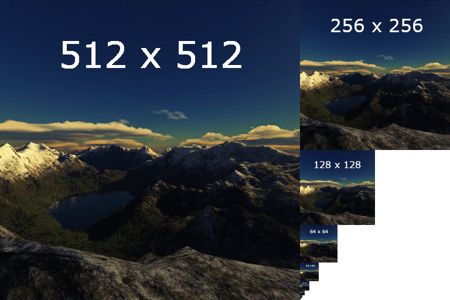
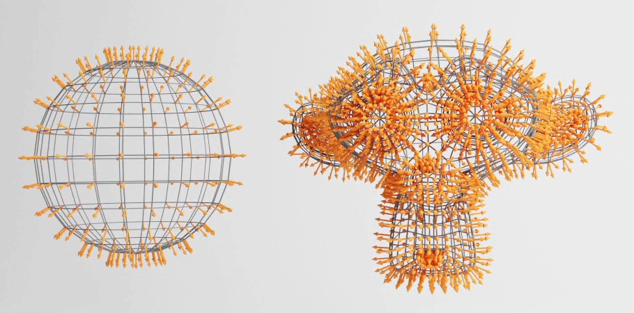

## What is WebGL

- WebGL enables web content to use an API based on OpenGL ES 2.0 to perform 2D and 3D rendering in an HTML canvas in browsers that support it without the use of plug-ins.

  - A JS API.
  - Result can be drawn in <canvas>
  - Compatible with most modern browsers

- WebGL programs consist of control code written in JavaScript and shader code (GLSL) that is executed on a computer's Graphics Processing Unit (GPU).

  - It uses the GPU and so is able to do things with graphics super fast.
    - The CPU can do calculations really fast but one by one, GPU on the other hand is a bit slower but can do things in parallel.

- To draw a 3D model we need to draw a lot of triangles and colorize them so they look how we want them to look.

  - The GPU will position all those points at once according to many factors.
  - Once the points are placed the GPU will then draw all visible pixels of those triangles, which will be calculated and drawn in parallel and very fast.
  - The instructions to place the points and draw the pixels are written shaders.
    - Shaders are just programs that will run on GPU.

- Native WebGL benefits from existing at low level which enables optimizations and more control.

- There are lots of frameworks available that encapsulate WebGL's capabilities, making it easier to build 3D applications and games. Eg. THREE.js, BABYLON.js etc.
  - Three.js is a JavaScript library that supports different forms of three-dimensional in-browser rendering including CSS3D and WebGL.
  - Three.js is just above WebGL.
  - We can still interact with WebGL and create our own shaders.
  - It's the most popular WebGL library and quite close enough to native WebGL.

## Understanding Three.js

- Three.js works on the basis of scenes and objects. In order to render (show) an object, it must first be added to a scene. As a collection of objects, a scene is then paired with a camera (a view into a scene) and usually animated.
- Three.js prefers a three-step series of functions.
  - The first is an initialization of the settings for the project.
  - The second is usually an animation or updating loop.
  - The third is usually updating, rendering loop, which connects into the second.
- The first, initialization loop usually runs one time with the animating and rendering loops running infinitely as long as the project continues to be shown to users.

## Basic Terminologies

- **Scene** is a container where we put our actors, lights, camera etc and which will later be rendered on the screen.
- **Mesh/Object** is a combination of geometry(shape) and material(looks).
  - NOTE: Once a mesh is created always remember to add it in the scene.
- **Camera** serves as a point of view when doing a render, one can have multiple cameras but only one can render at a time and can switch between them. They are not visible.
  - **FOV** is the extent of the scene that is seen on the display at any given moment. The value is in degrees. Field of view is the verticle vision angle.
  - **Aspect ratio** is w/h of the renderer.
  - **near and far clipping plane** means that objects further away from the camera than the value of far or closer than near won't be rendered.
- **Renderer** will take a scene and a camera and then render the scene from camera point of view. The results are drawn in canvas.
- A scene is created, Objects are then added to the scene. And then, when paired with a camera, scene can be rendered (shown) and animated/updated (refreshed).

## Using a bundler for Three.js

- A bundler is a tool that bundle up the entire project in one file with further modifications.

## Transformation

- Major Transformation properties are:
  - position
  - scale
  - rotate
  - quaternion
- All the transformation properties are compiled in matrices.

## Animation in 3js

- Animation is like stop motion(move stuffs take a pic, move them again take a pic again and so on).
- The number of images/frames shown per second is called fps. The more the fps the smoother the animation.
- For animations we create a function that will handle the animation and then we call it.
  - The functions that handles the animation just update the object, render the scene on screen and then call somehow calls itself in the next frame(here using `window.requestAnimationFrame`).
  - `requestAnimationFrame` will take a function and then call that function in the next frame.
  - Now people use a library called GSAP(Green soak animation platform), so now the animation function just render the scene on screen and calls itself in the next scene, the updation of the object is done using gsap.

## Camera

- There are a few different cameras in three.js.
- Camera is an abstract class, so it can't be used directly.
  - OrthographicCamera
  - PrespectiveCamera
  - ArrayCamera
  - StereoCamera
  - CubeCamera

## Controls

- Inside of the library itself, there are no control schemes nor ways of moving objects via user input. However, inside the collection of examples are few ways to approach this problem.
- **Controls** are available in three.js's collection of example and are used extensively to control things based on different situations. These are just like event listeners that listens for clicks, device's rotation etc.
  - Orbit Controls
  - Device Orientation Controls
  - Fly Control
  - First Person Control
  - Pointer Lock Control
  - Trackball Control
  - Transform Control
  - Drag Control
- Controls provide us with some functionality like rotation with mouse drag and stuffs like that but if we want we can implement those things on our own as well.
- Controls are handy but they have their limitations, if one want to use them just make sure they support all the features one need otherwise do things customly.

## Fullscreen and Resizing

- A full screen can be achieved if we just set the sizes according to the browser window using the DOM and some basic CSS.

  - The whole area that display things for us is the _screen_, The browser's area is the _window_, and the area of the canvas that display the WebGL content is the _viewport_.
  - To get the real full screen we can `requestFullScreen`.

- For resizing we need to listen to the resize using DOM. On recieving the change just update the size of viewport to current window size.
  - Just resizing won't be enough we need to update the camera and renderer's size as well.
- **Pixel Ratio**: The pixel ratio is the ratio between physical pixels and logical pixels. How many physical pixels one can have on the screen for one pixel unit on software part.
  - High pixel ratio means more stress on GPU which is not a good thing.

## Geometry in Three.js

- A geometry is composed of vertices(point co-ordinates in 3D space with some data) and faces(triangle that join these vertices to create a surface).
- Geometry can be used to create meshes as well as particles.
- NOTE: A Vertex can store more data than positions like UV co-ordinates, normals, colors, texture co-ordinates etc.
- Some common Geometry in Three.js are
  - BoxGeometry
  - PlaneGeometry
  - CircleGeometry
  - ConeGeometry
  - CylinderGeometry
  - TorusGeometry
  - TorusKnotGeometry
  - SphereGeometry
  - TextGeometry
- One can also create their custom geometry using Geometry class in Three.js.
  - A single point in 3D space can be created using Vector3 in Three.js.
  - A face in 3D space can be created using Face3 in Three.js.
    - A Face3 will use the vertices array of the geometry in which it is pushed to create faces.
  - Both the point(Vector3) and faces(Face3) can be pushed in a geometry(Geometry) and be used accordingly.
- **Buffer Geometry** are more efficient and optimised but less developer friendly so it's a lot of code when we try to create a custom buffer geometry.
  - Almost all Geometry have a buffer version.
  - When working with BufferGeometry, we store the values in an Array(Float32Array), then convert that array into BufferAttribute and finally set it as BufferGeometry's attribute.
  - Here we don't need to create faces explicitly.
  - Some Geometry's faces can share common vertices, so when creating a buffer geometry we can specify a bunch of vertices and then the indices to create the faces and re-use vertices multiple times.

## Debug UI

- When working with computer grahics we need to constantly tweek and sometimes debug to get the desired result we want and for that we can't just switch between the code and browser so we want someting in the browser that can help us.
  - We can do that using a basic html input tag and then link it using js.
  - We can also use some cool libraries like dat.GUI, control-panel, ControlKit, Guify, Oui etc.

## Textures

- Textures are images that cover the surface of the geometries.
  - Color (Albedo) is a simple color applied on geometry.
  - Alpha Texture is a grayscale image where white is visible and black is not visible.
  - Height(Displacement) Texture is also a grayscale image which moves the vertices to create some reliefs.
    - For this one need good amount of vertices so enough subdivision is needed.
  - Normal Texture adds details, but the vertices won't move so it doesn't need subdivision instead it just lures the light about the face orientation.
    - It provides better performance than adding a Height Texture.
  - Ambient Occlusion is again a grayscale image, it adds fake shadows in crevices which is not accurate but help us create contrast.
  - Metalness is also a grayscale image where white means metallic and black means non-metallic.
    - It's mostly used for reflection.
  - Roughness is also a grayscale image where white means rough and black means smooth.
    - It's mostly used for light dissipation.
- A `texture loader` can be used to load multiple textures in a three.js app.
- PBR(Physically based rendering) principles are the technics that tends to follow real-life directions to get realistic results.
- A UV map is the flat representation of the surface of a 3D model used to easily wrap textures. The process of creating a UV map is called **UV unwrapping**.
  - The texture is being squeezed or streached in different ways to cover the geometry.
  - Each vertex will have a 2D co-ordinate on a flat plane(UV map).
- With textures on the mesh we can repeat the texture, set some offset value for the texture, do transformation on texture(Rotate, Translate, Scale) etc.
- There is no such thing as a 3D texture, as they’re always based on a 2D image. This is where UV mapping comes in, as it is the process of translating your 3D mesh into 2D information so that a 2D texture can be wrapped around it.

- **Filtering** and **Mipmapping** is a technique that consists of creating half a smaller version of the texture again and again until we get a 1x1 texture.
  - All the texture variants are send to GPU and the GPU selects the most appropriate version of the texture.
  - Mipmapping increase the number of pixels.
  - It is used in 3D scenes to decrease the time required to render a scene.
  - It is a technique where a high-resolution texture is downscaled and filtered so that each subsequent mip level is a quarter of the area of the previous level.
    
  - _Minification filter_ happens when the pixels of texture are smaller than the pixels of the render i.e. the texture is too big for the surface it covers.
  - _Magnification filter_ happens when the pixels of texture are bigger than the pixels of the render i.e. the texture is too small for the surface it covers.
- When creating textures keep the weight, the data and the size(resolution) in your mind.
  - The user will have to download the texture so we should keep them light like image compression.
  - Each pixel of the texure will have to be stored in the GPU, so the size of image should be less.
  - Mipmapping will produce half the smaller version of textures repeatedly until 1x1 so the texture width and height must be power of 2.

## Materials

- Materials are used to put color on each visible pixel of a geometry. The algorithm of which is written in shaders(fragment shader).
- Materials in three.js are
  - MeshBasicMaterial
  - MeshNormalMaterial
  - MeshMatcapMaterial
  - MeshDepthMaterial
  - MeshLambertMaterial
  - MeshPhongMaterial
  - MeshToonMaterial
  - MeshStandardMaterial (requires light source)
  - MeshPhysicalMaterial
  - PointsMaterial (For particales)
- Normals are information that contains the direction of the outside of the face. They can be used for lightning, reflection, refraction etc.
  
- MeshStandardMaterial uses PBR.
- ShaderMaterial and RawShaderMaterial can be used to create custom materials.
- Environment Map is an image of what's surrounding the scene. It can be used for reflection and refraction but also for general lighting.

## 3D Text

- A `font loader` can be used to load multiple fonts in a three.js app.
- A text can be created either by `TextGeometry` or `TextBufferGeometry`.
- Fonts in three.js should be typeface.
- **Bounding** is an information associated with the geometry that tells what space is taken by the geometry. It can be a box or a sphere.
  - This help three.js calculate if the object is on the screen or not(**frustum culling**).

## Light

- Adding lights in three.js is as simple as adding a mesh, just instantiate the right class and add it to the scene.
- Types of lights
  - **Ambient light** applies _omnidirectional lighting_ where we define only color and intensity. Every part of the mesh is going to lit with exact same intensity regardless of it's position and direction.
    - It's a general level of illumination that does not come directly from a light source
    - It's used to simulate light bouncing effect. It consists of light that has been reflected and re-reflected so many times that it is no longer coming from any particular direction.
  - **Directional light** will have a sun like effect as if sun rays were travelling in parallel.
    - It's like light source is at an infinite distance from the scene.
  - **Hemisphere light** is like directional light right above the scene but with different color from the sky than from the one coming form the ground.
    - This can't be used to create shadows.
  - **Point light** is like a pocket lighter. They starts at infinitely small point and spreads uniformly in all directions.
    - These are used to add lighting within a room or to enhance the lighting within a spherical object. These shine light in all directions
    - Unlike a directional light, these can be moved around and rotated to shine light in a specific direction.
  - **Rect Area light** is like a big rectangular plane light available on the photoshoot set. It's a mix between directional and diffuse light.
    - This only works with `MeshStandardMaterial` and `MeshPhysicalMaterial`.
  - **Spot light** is like a flashlight. It's a cone of light starting at a point and oriented in a direction.
- _Baking_ is a general term for embedding pre-computed information into an asset for the purposes of optimizing the rendering of that asset.
  - There is texture/map baking, animation/simulation baking, light baking.
- To assist us with positioning of the lights, three.js provided us with helpers. They help us see how certain light source are projecting light to our scene.
  - Hemisphere light helper
  - Directional light helper
  - Point light helper
  - Rect Area light helper
  - Spot light helper

## Shadows

- Dark part in the back of an object is called _core shadow_ but the hard part is _drop shadow_.
- Shadows in three.js
