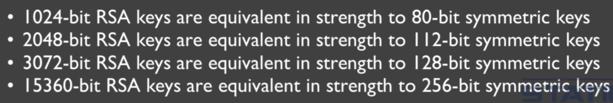
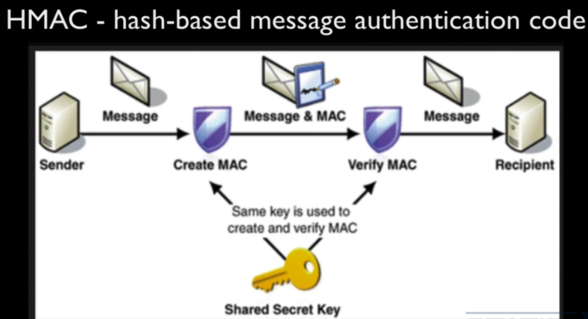
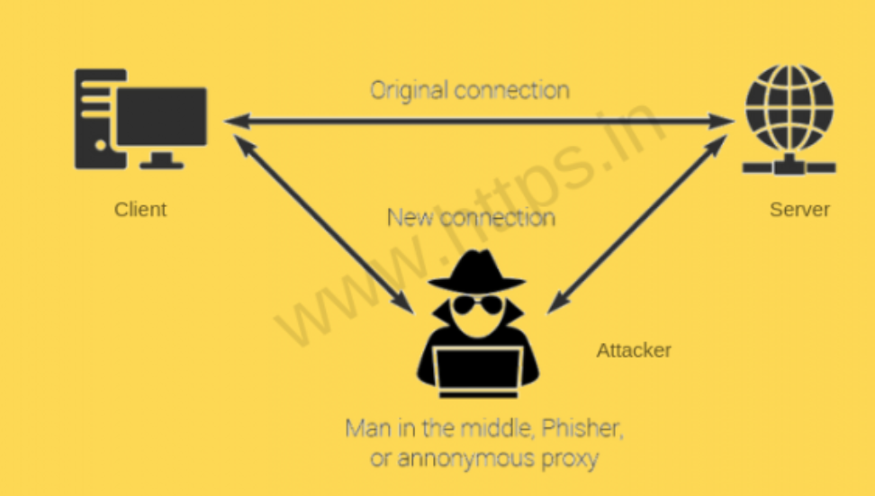

- _Encryption_ is a method of converting a plain text into a form that is unreadable(ciphertext), _Decryption_ is the method of converting a cyphertext back to redable plain text.
- Two main things for encryption is _Algorithm_(Public) and _Key_(Secret). With the combination of these two the plaintext will be converted to cyphertext.

## Symmetrical Encryption

- **Symmetrical Encryption**: Symmetric encryption is a type of encryption where **only one key (a secret key) is used to both encrypt and decrypt electronic information**.

  - AES(Advanced Encryption Standard), DES(Data Encryption Standard), Triple DES (3DES), Blowfish, RC4, RC5, RC6.
  - Symmertical encryption is fast and strong.

## Asymmetrical Encryption

- **Asymmetrical Encryption**: Asymmetric Encryption uses **two distinct, yet related keys**. The Public Key, is used for encryption and the other, the Private Key, is for decryption.

  - Mostly it is used to Key-Exchange and agreement.
  - RSA(Rivest-Shamir-Adleman), ECC(Elliptic Curve Cryptosystem), DH(Diffie-Hellman), El Gamal.
  - The Public-Private key pair is generated at the same time as they are mathematically related and the encryption done by one key can be decrypted by it's other paired key only.
    - When a session begin the public key of both the parties are exchanged.
    - If we encrypt with the public key then **it assures _Confidentiality_** as decryption can only happen with the paired private key. So it's assured that the message can't be read by someone else as they can't have the private key.
    - If we encrypt with the private key then **it assures _Authentication_** as decryption can only happen with the paired public key. So only the person who has the private key can send the messsage that can be decrypted by that shared public key which gaurentee that the other person is genuine.
      - This gives the assurence to the reciever that only person who could have encrypted the data is the individual who posses the private key.
  - Asymmetrical encryption is Scalable, has better key distribution, can help with authentication and nonrepudiation but is also slow and mathematically intensive.
    

## Hash functions

- **Hash Function**: Hash functions take a string of any size and convert it into a gibrish value of fixed size.

  - When passed same input it will always produce same output.
  - Hash functions are irreversible.
    - The best thing about Hash function is that it's only one way i.e. one can't get the string back from the gibrish. (**This assures integrity**)
  - Hash functions and digital signatures help us **provide the authentication and legitimacy** of the senders and the receivers.
  - MD2, MD4, MD5, HAVAL, SHA, SHA-1, SHA-256, SHA-384, SHA-512, Tiger
  - **HMAC (Hash Based Message Authentication Code)**: In this we include a pre shared secret into the message which is to be send and then hash it. **This assures Authentication and Integrity**.
    
    - One can't alter the message as the message with the key is hashed not just the message. eg. JWT token.
  - Messages are stored in the hashed format in the databases so even if the database is hacked the passwords will not be revelead but it has a loop hole i.e. if the hacker send a password and the generated hash matched with any hash value in DB then the hacker will know the password, that's why the passwords are not directly hashed they are first added with the salt and then hashed.4
    - Salt is random data that is used as an additional input to a one-way function that hashes data, a password or passphrase. Salts are used to safeguard passwords in storage.
    - Salts create unique passwords even in the instance of two users choosing the same passwords.
    - Salts help us mitigate hash table attacks by forcing attackers to re-compute them using the salts for each user.

## Digital Signatures

- **Digital Signatures**: It is basically a hash value that is encrypted using the sender's private key.

  - This provide us with Authentication(private key for encryption), Nonrepudiation(Use of private key that only the sender possess) and integrity(Hash function).
  - To check if the digital signature is valid, the digitally signed message is decrypted using the public key to get the hash value that can later be verified.
  - Digital signature ensures that the software or whatever recived came from the correct publisher and also protect the message from altering after being published or sent.

## SSL(Secure Socket Layer) and TLS(Transfer Layer Security)

- These are cryptographic protocols designed to provide communication security over a network or internet.
- SSL is older and TLS is new encryption method.
- TLS is most widely used method for encrypting data on the internet.
- TLS provides privacy as it encrypt the data, data integrity as it uses message authentication code(MAC) when communicating between 2 applications.
- TLS supports the security services of confidentiality or privacy, authentication and integrity.
  - Connection is private as a symmetric algorithm is used to encrypt the data transmitted.
    - The keys for symmetric encryption are generated uniquely for each connection and are based on a secret negotiation at the start of the session.
    - The server and client negotiates the details of which encryption algorithm in cryptographic keys be used before any data is transmitted.
    - This negotiation of the shared secret cannot be read by attacker even by an attack who placed himself in the middle of the attack.
    - The connection is also reliable as no attacker can modify the communication during the negotiation without being detected.
  - The identity of the communicating parties can be authenticated using public key cryptography, certificates and digital signatures.
    - Authentication is most of the time optional and are only done for servers, so we can know we are getting the data from the authenticated server.
  - The connection is reliable as each message transmitted includes a message integrity check using a message authentication code (MAC) to prevent undetected loss/alteration of data during transmission.
  - TLS supports many methods for exchanging keys, encrypting data, authenticating message integrity.
- Diffe-Hellman key exchange assures the _forward secracy_ property.
  - _forward secracy_ means if the server we are communicating with is compromised and their private key is compromised it still doesn't mean that all of the previous sessions cannot be decrypted as a new private key is generated in each session.
- The combination/set of cryptographic algorithims that help secure a network connection is called _ciphersuites_.
- **SSL Striping**: SSL stripping is a technique by which a website is downgraded from https to http.
  - The attack is used to circumvent the security which is enforced by SSL certificates on https sites. This is also known as SSL downgrading.
  - The attacks expose the website to eavesdropping and data manipulation by forcing it to use insecure HTTP rather than secured https. Victim is made to believe that the data he is exchanging is secure and encrypted when transmitted over the network to the server. But the fact is there is no authenticity of data that is traveling because the encryption is stripped off and the data is in plaintext vulnerable to MITM.
  - When you enter the URL on the browser, the first connection will be a plain http before it gets redirected to secure https. The attacker takes advantage of this small window by using the SSL strip attack.
    
  - The point to be noted here is the attacker's machine and the server will have SSL encrypted connection.
  - MITM(Man-in-the-middle attack) is possible only when the attacker and victim are on the same network.
- **Spoofing Attack** is a situation in which a person or program successfully identifies as another by falsifying data, to gain an illegitimate advantage.
  - **ARP spoofing** is a type of attack in which a malicious actor sends falsified ARP (Address Resolution Protocol) messages over a local area network. This results in the linking of an attacker's MAC address with the IP address of a legitimate computer or server on the network.

## HTTPS

- They are protocols using which the information of a particular website is exchanged between Web Server and Web Browser.
- HTTP stands for HyperText Transfer Protocol and extra s present in HTTPS mean it's secure.
  - _Hypertext_ is text which is not constrained to be linear. Hypertext is text which contains links to other texts.
  - _HyperMedia_ is a term used for hypertext which is not constrained to be text: it can include graphics, video and sound, for example.
  - Hypertext and HyperMedia are concepts, not products.
- HTTP is a protocol using which hypertext is transferred over the Web. Due to its simplicity, http has been the most widely used protocol for data transfer over the Web.
  - The data (i.e. hypertext) exchanged using http isn’t secure hyper-text exchanged using http goes as plain text i.e. anyone between the browser and server can read it relatively easy if one intercepts this exchange of data.
  - HTTPS was introduced so that a secure session is setup first between Server and Browser. Cryptographic protocols such as SSL and/or TLS turn http into https.
  - **https = http + cryptographic protocols**
- http uses default port 80 while https uses default port 443.
- Security in https is achieved at the cost of processing time because setting up of a secure session is done before the actual hypertext exchange between server and browser.
  - Setting up secure session basically mean Web Server and Web Browser needs to exchange encryption keys using Certificates before actual data can be transferred.
  - When you access a website with HTTPS, web server will start the task to invoke SSL/TLS and protect the communication.
  - The server sends a message back to the client indicating a secure session should be established and the client in response sends it security parameters(hand shaking phase). The server authenticates the client by sending it a digital certificate and if the client descide to trust the server the process continues sometimes the server also want the client to send the digital certificate too, for mutual authentication(not often).
    - A Handshake is an automated process of negotiation between two participants(here server and client) through the exchange of information that establishes the protocols of a communication link at the start of the communication, before full communication begins.
  - The client generates a symmetric session key using symmetric encryption like AES and encrypts it using server's public key. This public key is send to the server and they both uses the symmetric key to encrypt the data they send back and forth.
