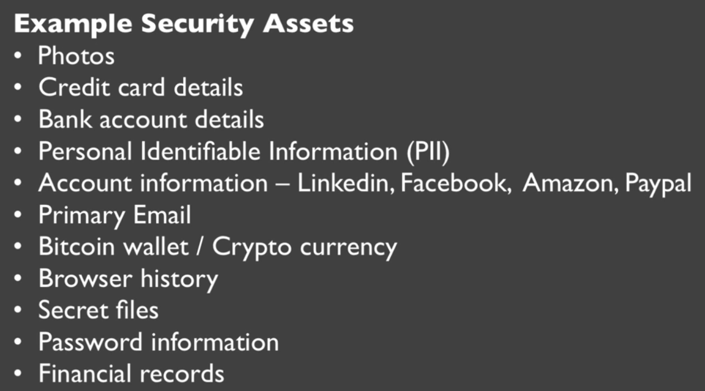
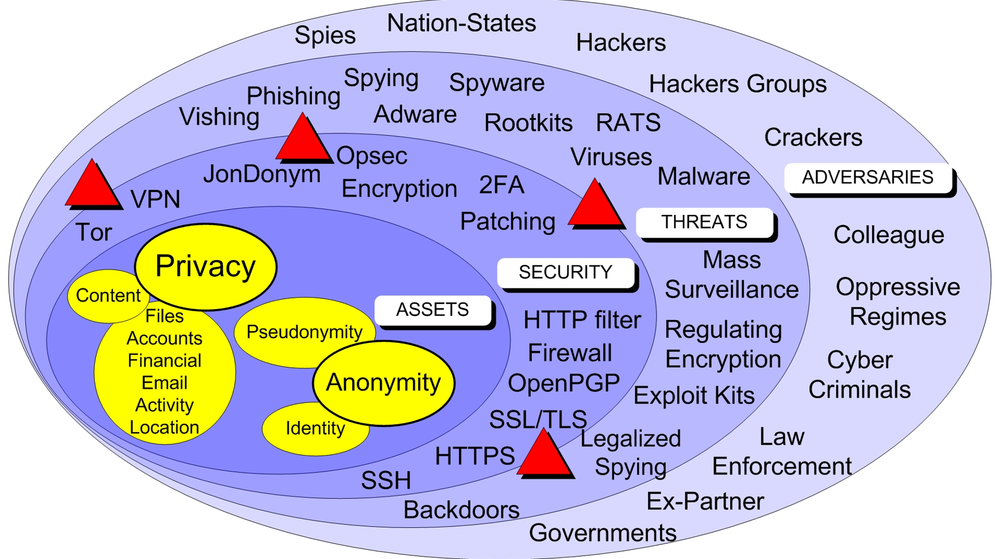

## **Security assets**

- Time is valuable so we want to invest as little as our resources in security, we should do whatever we wanna do and not worry about the security.
- Protect what you values most and get on with things we wanna do.
- To protect something we should know what we value and how much we value that thing.
- Select the Assets wisely.
- 

## **Privacy, Anonymity and Pseudoanonymity**

- **Privacy** is about maintaining confidentiality and keeping secrets.
  - Privacy is when people don't know what we are doing but know who we are.
- **Anonymity** is when people know what you are doing but don't know who you are.
  - Anonynmity is about keeping the identity secret.
- **PseudoAnonymity** is about keeping an alias name, a cover name, being anonymous but known.

- Security is the degree to which our assets are resistant to threat from adversaries.

  - Security controls are selected based on the type of threat and adversaries we face.
  - A threat will try to exploit vulnerabilities in the security to impact the assets.
  - **RISKS = (Vulnerabilities X Threats X Impact)**
  - 

- **Risk Assesment**: We can't have 100% security so risk assesment is what we do to implement good security controls.

  > Privacy isn't about hiding something. It's about being able to control how we present ourselves to the world. It's about maintaining a public face while at the same time being permitted private thoughts and actions. It's about personal dignity. - Bruce Schneier

## **Security Attributes**

- Assets are given security measures selected by risk assesment and based on the Security attributes i.e. **Confidentiality, Integrity, Availability (C-I-A Triad)**.

  - Other common security attributes includes Possession, Authenticity, Utility, Non-Repudiation, Authentication, Authorization.

- Defence in Depth: _Prevent->Detect->Recover_.

  - The idea is _what we can't prevent we detect, what we can't detect we recover from_.
    

- **Zero Trust Model**: The lesser the trust the lower the risk.
  - Mitigate the risk by distributing the trust.
  - Trust nothing or no-one, evaluate the risk and distribute the trust.
