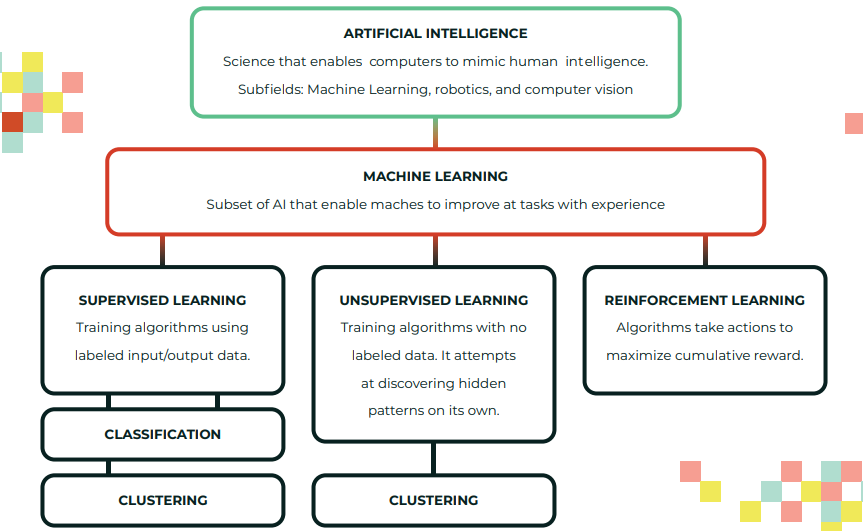
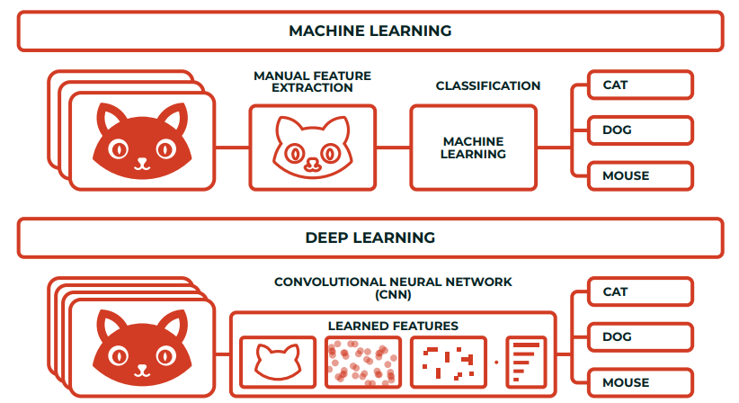
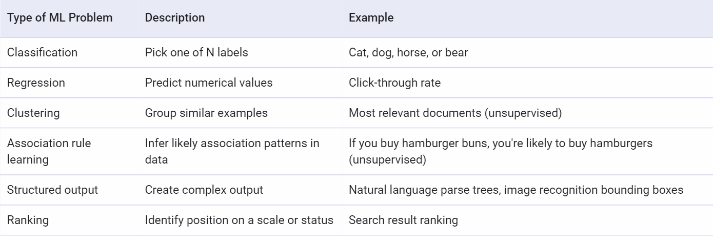
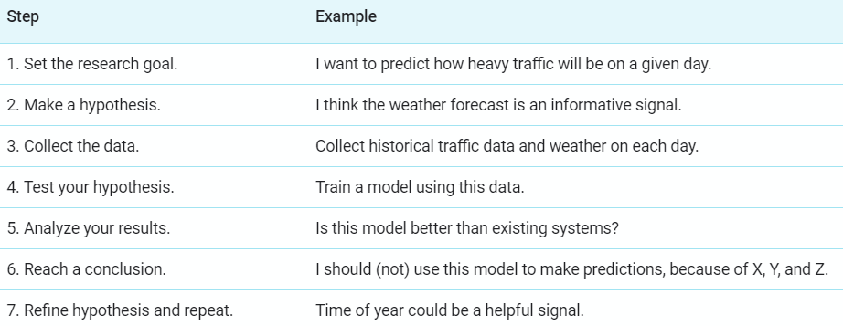
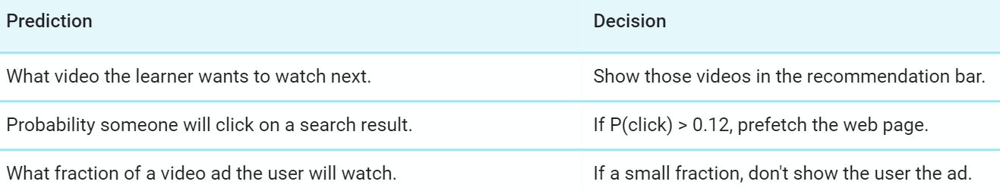
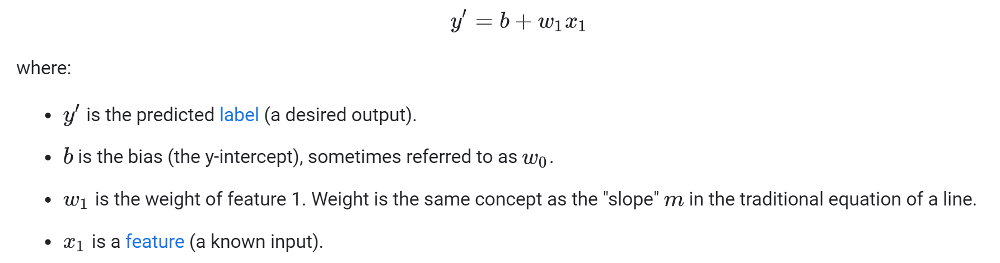
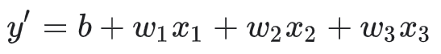

## What is ML

- ML is the process of training a piece of software, called a **model**, to make useful predictions using a data set. This predictive model can then serve up predictions about previously unseen data.
  - eg. the system predicts that a user will like a certain video, so the system recommends that video to the user.
- **Model**: The representation of what a machine learning system has learned from the training data. It defines the relationship between features and label. We can think of model as a function whose input is the features and the output is label.
- ML problems falls along a spectrum of supervision between **supervised** and **unsupervised** learning.
  - Supervised learning is a type of ML where the model is provided with **labeled** training data containing features and a label.
    - Features are variables that describe our data, the label(Typically represented by the variable **y**.) is essentially the answer of ML problem or what a particular set of feature should predict or the output variable.
      - Basically feature is an input variable used in making predictions. Typically represented by the variables **{x1, x2, ..., xn}**.
      - A particular **example**(one row of a dataset) to be feeded into model can have one or more features but only one label.
    - In **supervised machine learning**, one feed the features and their corresponding labels into an algorithm in a process called **training**. During training, the algorithm gradually determines the relationship between features and their corresponding labels. This relationship is called the **model**.
    - Supervised machine learning finds patterns between data and labels that can be expressed mathematically as functions.
  - Main Supervised Learning models are:
    - A **regression** model predicts continuous values.
    - A **classification** model predicts discrete values.
  - An **example** is a particular instance of data, **x**. (We put **x** in boldface to indicate that it is a vector.) We break examples into two categories:
    - labeled examples: A **labeled example** includes both feature(s) and the label, used for training our model.
    - unlabeled examples: An **unlabeled example** contains features but not the label, for testing our model.
  - **Training** means creating or **learning** the model.
  - **Inference** means applying the trained model to unlabeled examples.
  - In **unsupervised learning**, the goal is to identify meaningful patterns in the data. To accomplish this, the machine must learn from an unlabeled data set.
    - The model has no hints how to categorize each piece of data and must infer its own rules for doing so.
    - This is helpful when working with unstructured data or where we want the model to find patterns.
    - **Clustering** is typically done when labeled data is not available. This is an _unsupervised_ learning problem.
      - For example, Google Photos uses clustering to group pictures of the same person together.

## AI VS ML VS DL

- AI is science that empowers computers to mimic human intelligence such as decision making, text processing, and visual perception.

  - AI is a broader field (i.e. the big umbrella) that contains several subfield such as machine learning, robotics, and computer vision.

  - 

- Machine Learning is a subfield of Artificial Intelligence that enables machines to improve at a given task with experience.

  - It is important to note that all machine learning techniques are classified as Artificial Intelligence ones. However, not all Artificial Intelligence could count as Machine Learning since some basic Rule-based engines could be classified as AI but they do not learn from experience therefore they do not belong to the machine learning category.

- Deep learning is a specialized field of machine learning that relies on training of Deep Artificial Neural Networks (ANN) using a large dataset such as images or texts.

  - ANNs are information processing models inspired by the human brain. The human brain consists of billions of neurons that communicate with each other using electrical and chemical signals and enables humans to see, feel, and make descision.
  - ANN works by mathematically mimicking the human brain and connecting multiple "artificial" neurons in a multilayered fashion.
  - The more hidden layers added to network, the deeper the network gets.

- ML process

  1. Selecting the model to train.
  2. Manually performing feature extraction.

- DL process

  1. Selecting the architecture of the network.
  2. Features are automatically extracted by feeding in the training data (such as images) along with the target class (label).

- 

## Classifying ML problems

- 

## What is RL

- Reinforcement learning is an active field of ML research.
- In RL one don't collect examples with labels.
  - Imagine you want to teach a machine to play a very basic video game and never lose. You set up the model (often called an **agent** in RL) with the game, and you tell the model not to get a "game over" screen.
- During training, the agent receives a reward when it performs this task, which is called a **reward function**. With reinforcement learning, the agent can learn very quickly how to outperform humans.
- Designing a good reward function is difficult, and RL models are less stable and predictable than supervised approaches.

## ML mindset

- ML help programmer
  - To reduce the time programming
  - Customise and scale some products easily
  - Help us do problems that seem unprogrammable.
  - Changes the way a software engineer think about a problem.
- Machine Learning changes the way you think about a problem. The focus shifts from a mathematical science to a natural science, **running experiments and using statistics**, not logic, to analyse its results.
- Implementing ML is different than traditional programming.
  - In traditional programming, you have set parameters and you understand how everything should behave.
  - With ML, the non-coding work can be very complicated, but you'll usually write far less code.
  - Eg. we can teach a model to recognize cats in photos, but it is difficult to know what features the model uses to determine something is in fact a cat.
  - This uncertainty can feel a little uncomfortable at times if you are used to determining every detail of your code's behavior.
- To address the challenges of transitioning to ML, it is helpful to think of the ML process as an experiment.
  

## A good ML Problem

- Start with the problem, not the solution. Make sure you aren't treating ML as a hammer for your problems.
  - Before trying to do everything with ML ask yourself these questions:
    1.  What problem is my product facing?
    2.  Would it be a good problem for ML?
- ML requires a _lot_(that depends on the problem, but more data typically improves your model and therefore your model's predictive power) of relevant data.
  - A good rule of thumb is to have at least thousands of examples for basic linear models, and hundreds of thousands for neural networks.
  - If you have less data, consider a non-ML solution first.
- Keep in mind that the features contains predictive power.
  - The feature one descide depends on it's understanding of problem so be prepared to have your assumptions(based on problem's understanding) challenged.
  - If you understand the problem clearly, you should be able to list some potential solutions to test in order to generate the best model.
  - Understand that you will likely have to try out a few solutions before you land on a good working model.
  - You should not try to make ML do the hard work of discovering which features are relevant for you.
- Aim to make decisions, not just predictions.
  - Decisions mean that the product should take action on the output of the model.
  - For example, a model that predicts the likelihood of clicking certain videos could allow a system to prefetch the videos most likely to be clicked.
  - ML is better at making decisions than giving you insights.
    

## Challenging ML problems

- Meaning of each cluster in an unsupervised learning problem.
  - For example, if your model indicates that the user is in the blue cluster, you'll have to determine what the blue cluster represents.
- You can try to assign a meaning to a cluster, but this can be tricky because the model might not group by criteria that you find intuitive.
- An alternative approach is to label some items before you cluster, and then try to propagate those labels across the entire cluster.
  - For instance, if all items with label X end up in one cluster, maybe you can spread label X to other examples.
- ML can identify correlations—mutual relationships or connections between two or more things.
  - But it can't determine causation from only observational data.
  - In general, you need to intervene in the world—run an experiment—to determine causation; you can't see it in purely observational data.
  - For eg. Did consumers buy a particular book because they saw a positive review the week before, or would they have bought it even without that review?
- If there are no patterns or only trivial patterns, then machine learning probably will not provide value.
- If there are many patterns and it is important to make accurate predictions, then using machine learning might be the right approach.

## Descending into ML

- **Linear regression** is a method for finding the straight line or hyperplane that best fits a set of points.
- By convention in machine learning, you'll write the equation for a model slightly differently:
  
  - A more sophisticated model might rely on multiple features, each having a separate weight (w1, w2, etc.).
    - For example, a model that relies on three features might look as follows:
      
- An intercept or offset from an originis called **bias**.
  - Bias (also known as the bias term) is referred to as b or w0 in machine learning models.
- A coefficient for a feature in a linear model, or an edge in a deep network is called **weight**.
  - The goal of training a linear model is to determine the ideal weight for each feature.
  - If a weight is 0, then its corresponding feature does not contribute to the model.
- In supervised learning, a machine learning algorithm builds a model by examining many examples and attempting to find a model that minimizes loss; this process is called **empirical risk minimization**.
  - _loss_ is a number indicating how bad the model's prediction was on a single example.

## DATA PROCESSING

-
