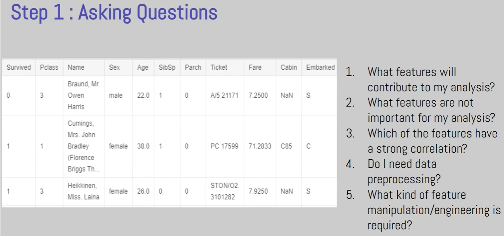
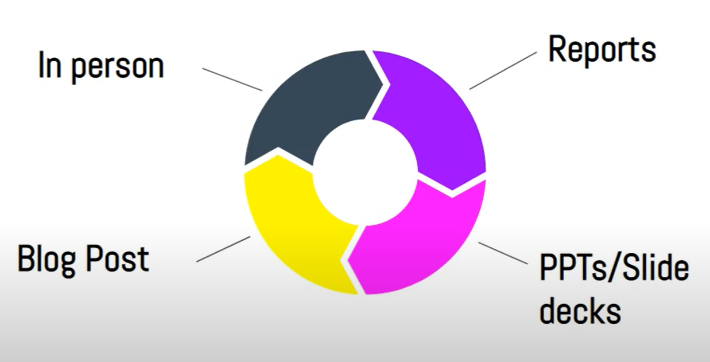
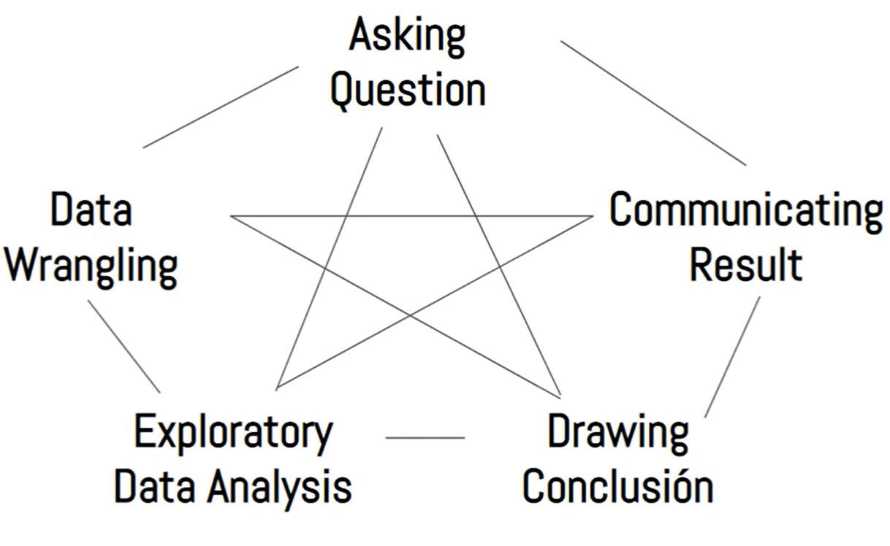
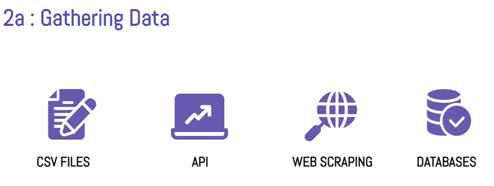

# Data Analysis

Data analysis is a process of inspecting, cleansing, transforming, and modelling data with the goal of discovering useful information, informing conclusions, and supporting decision-making.

# Data Analysis Process

## **Asking Right Questions**

To ask Better Question

- Subject Matter Knowledge/Expertise
- Experience

## **Data Wrangling/Munging/Preprocessing** (Cleaning the Data, takes most of the time)

Process of transforming/mapping data from one format "raw" data form into another format with intent of making it more appropriate and valuable for a variety of downstream purpose like analytics.

This is done is 3 major steps:

- Gathering Data
  - Collecting data to work on
- Assessing Data
  - Finding number of rows and columns (shape)
  - Memory occupied by dataset, Data type of various column and checking for missing values (info())
  - Check for duplicate data (is_unique())
  - High Level mathematical overview of data (describe())
- Cleaning Data
  - What to do with missing data (replace them by mean, median, mode or remove the column itself).
  - Remove Duplicate Data
  - Change incorrect Data type

## **Exploratory Data Analysis** (Trying to find pattern in data)

We explore and augment the data.

Exploring Data is about

- Finding Correlation and Covariance
- Doing univariate and multivariate analysis
- Plotting Graph aka Data Visualization

Feature Engineering (Augmenting Data) is about

- Removing Outliers in scatterplots
- Merging Dataframes
- Adding new Columns

## **Drawing Conclusions** (Result of EDA)

This can be done in various ways like Machine Learning, Inferential Statistics, Descriptive Statistics.

## **Communicating Results/ Data Storytelling**

Here Communication Skills is the key.

- The best part about this is we are not required to do these steps linearly
  

# **Data Wrangling**

This is done is 3 major steps:

- Gathering Data
  
- Assessing Data
- Cleaning Data

## **Assessing Data**

It is about getting the dataset and then analysing and assesment of data so we can clean it in the next step.

There are several options for getting the dataset into Jupyter:

- Download the CSV manually and upload it via Jupyter's GUI
- Use the urlretrieve function from the urllib.request to download CSV files from a raw URL
- Use a helper library, e.g., opendatasets, which contains a collection of curated datasets and provides a helper function for direct download.

### **Types of Unclean data**

- There are 2 kinds of unclean data
  - Dirty Data (Data with Quality/Content Issue)
  - Messy Data (Data with tidiness/structural Issue)

1. **Dirty Data**

   - It has following kind of issues
     - Duplicate Data
     - Missing Data
     - Corrupt Data
     - Inaccurate Data

1. **Messy Data**

   - Tidy data has following traits

     - Each Variable forms a column
     - Each observation forms a row
     - Each Observational unit forms a table

   - If any of the above trait is voilated then it is untidy/messy data.

### **Type of Assessment**

- There are 2 types of assessment styles

  - Manual: Looking through data manually in google sheets
  - Programmatic: By using pandas function like info(), describe(), sample(), etc.

- Steps in Assessment include 2 steps:

  - Discover
  - Document

- We first discover the issues and then document it and later in the data cleaning step all these issues are resolved.

### **Data Quality Dimensions for sorting Dirty data**

- There are 4 major type of quality issues
  1. **Completeness Issues**: Data is missing
  2. **Validity Issues**: Data is available but not valid
  3. **Accuracy Issues**: Data is available and valid but not accuratae
  4. **Consistency Issues**: Data is inconsistent

# **Exploratory Data Analysis**

EDA can be univariate analysis, bivariate analysis or multivariate analysis.

- Univariate Analysis is when we analyse only 1 column.
- Bivariate Analysis is when we analyse 2 columns at once.
- Multivariate Analysis is when we analyse more than 2 columns at once.

Columns can be of 2 types

- Numerical
- Categorical

## **Univariate Analysis**
